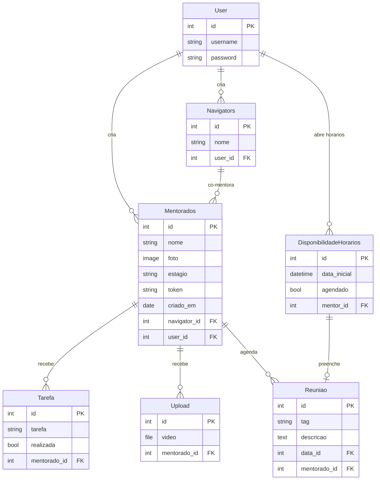

# 🧑‍🏫 PyMentor — Plataforma de Mentoria

> Plataforma web desenvolvida com Django para que mentores gerenciem seus mentorados, acompanhem progresso, criem tarefas e agendem reuniões.


-06B6D4?style=flat-square&logo=tailwindcss&logoColor=white)


Projeto desenvolvido durante a **13ª edição da Pystack Week**, promovida pela plataforma **[Pythonando](https://pythonando.com.br)**.

---

## 📋 Sumário

- [Sobre o Projeto](#sobre-o-projeto)
- [Funcionalidades](#funcionalidades)
- [Tecnologias Utilizadas](#tecnologias-utilizadas)
- [Arquitetura e Modelos](#arquitetura-e-modelos)
- [Pré-requisitos](#pré-requisitos)
- [Estrutura de Diretórios](#estrutura-de-diretórios)
- [Instalação e Configuração](#instalação-e-configuração)
- [Variáveis de Ambiente](#variáveis-de-ambiente)
- [Executando o Projeto](#executando-o-projeto)
- [Scripts Disponíveis](#scripts-disponíveis)
- [Rotas Disponíveis](#rotas-disponíveis)
- [Fluxo do Mentor](#fluxo-do-mentor)
- [Fluxo do Mentorado](#fluxo-do-mentorado)
- [Painel Administrativo](#painel-administrativo)
- [⚠️ Avisos de Segurança](#️-avisos-de-segurança)
- [Testes](#testes)
- [Como Contribuir](#como-contribuir)
- [Licença](#licença)
- [Pendências e Informações a Confirmar](#pendências-e-informações-a-confirmar)

---

## Sobre o Projeto

O **PyMentor** é uma aplicação web que permite que **mentores** administrem seus **mentorados** e seus respectivos **navigators** (co-mentores/assistentes), acompanhando o progresso de cada um por meio de:

- Cadastro e organização de mentorados por estágio de receita
- Criação e atribuição de tarefas
- Upload de vídeos de referência para mentorados
- Agendamento e gerenciamento de reuniões (blocos de 50 minutos)
- Portal exclusivo para mentorados acessarem suas tarefas e vídeos via token único

> [!NOTE]
> O projeto não possui uma view raiz em `/`. Ao acessar `http://127.0.0.1:8000/`, será retornado um 404. Navegue diretamente para `/usuarios/cadastro/` ou `/usuarios/login/`.

---

## Funcionalidades

### Para o Mentor

- ✅ Cadastro e login de mentores (username + senha)
- ✅ Cadastro de mentorados com foto, estágio de receita e navigator responsável
- ✅ Visualização dos mentorados em tabela com gráfico de pizza por estágio (Chart.js)
- ✅ Criação de **navigators** (assistentes/co-mentores)
- ✅ Criação de tarefas para cada mentorado
- ✅ Upload de vídeos vinculados a cada mentorado
- ✅ Abertura de horários disponíveis para reuniões (blocos de 50 minutos)
- ✅ Visualização das reuniões agendadas com descrição e tag temática

### Para o Mentorado (portal sem login Django)

- ✅ Acesso via **token único** gerado automaticamente pelo sistema
- ✅ Autenticação por cookie (`auth_token`) com expiração de **1 hora**
- ✅ Visualização das tarefas atribuídas pelo mentor
- ✅ Marcação de tarefas como realizadas (via HTMX, sem recarregar a página)
- ✅ Visualização de vídeos enviados pelo mentor
- ✅ Agendamento de reunião em horários disponibilizados pelo mentor, com escolha de tag temática e descrição

### Estágios de Receita dos Mentorados

| Código | Faixa de Receita    |
|--------|---------------------|
| E1     | R$ 3k – R$ 10k     |
| E2     | R$ 10k – R$ 100k   |
| E3     | R$ 100k – R$ 1M    |
| E4     | R$ 1M – R$ 10M     |
| E5     | R$ 10M+             |

### Tags Temáticas de Reunião

| Tag | Tema                    | Tag | Tema                  |
|-----|-------------------------|-----|-----------------------|
| G   | Gestão                  | T   | Tecnologia            |
| M   | Marketing               | P   | Produto               |
| RH  | Gestão de Pessoas       | V   | Vendas                |
| I   | Impostos                | CS  | Customer Success      |
| E   | Empreendedorismo        | D   | Desenvolvimento Pessoal |
| F   | Finanças                | N   | Networking            |
| S   | Startup                 | L   | Liderança             |
| DA  | Análise de Dados        | J   | Jurídico              |
| O   | Operações               | X   | Outros                |

---

## Tecnologias Utilizadas

| Tecnologia     | Versão              | Uso                                               |
|----------------|---------------------|----------------------------------------------------|
| Python         | 3.12+               | Linguagem principal                                |
| Django         | 5.2                 | Framework web                                      |
| Pillow         | 11.1.0              | Processamento de imagens (fotos de mentorados)     |
| SQLite         | 3                   | Banco de dados (padrão de desenvolvimento)         |
| asgiref        | 3.8.1               | Suporte assíncrono ao Django                       |
| sqlparse       | 0.5.3               | Formatação de SQL                                  |
| tzdata         | 2025.2              | Dados de fuso horário                              |
| HTMX           | 2.0.4 (unpkg CDN)   | Interatividade reativa (marcação de tarefas)       |
| Chart.js       | latest (jsdelivr CDN) | Gráfico de pizza por estágio de receita          |
| Tailwind CSS   | v4 (browser, jsdelivr CDN) | Estilização das interfaces via `@tailwindcss/browser@4` |

---

## Arquitetura e Modelos

O projeto é composto por dois Django apps e utiliza dois mecanismos de autenticação distintos:



### Fluxo de Autenticação Dual

| Perfil     | Mecanismo                                      | Proteção de Views              |
|------------|------------------------------------------------|--------------------------------|
| **Mentor** | Django Auth (sessão, `@login_required`)         | `@login_required` decorator    |
| **Mentorado** | Cookie `auth_token` com token único (1h TTL) | `valida_token()` no `auth.py` |

---

## Pré-requisitos

Antes de instalar, verifique se você possui:

- **Python 3.12 ou superior** — [download](https://www.python.org/downloads/)
- **pip** (geralmente incluído com o Python)
- **Git** — [download](https://git-scm.com/)

> [!WARNING]
> **Usuários Linux/macOS:** O arquivo `mentorados/views.py` utiliza `locale.setlocale(locale.LC_TIME, 'pt_BR.utf8')` para formatar datas em português. Certifique-se de ter o locale `pt_BR.utf8` instalado no sistema:
> ```bash
> # Debian/Ubuntu
> sudo locale-gen pt_BR.UTF-8
> sudo update-locale
> ```
> **Usuários Windows:** Este locale pode não estar disponível nativamente e pode causar erros na view de agendamento de reuniões. Veja a seção de [Pendências](#pendências-e-informações-a-confirmar).

---

## Estrutura de Diretórios

```
pymentor/
├── core/                           # Configuração central do projeto Django
│   ├── __init__.py
│   ├── settings.py                 # Configurações (BD, apps, idioma, timezone)
│   ├── urls.py                     # Roteamento raiz (admin, usuarios, mentorados)
│   ├── wsgi.py                     # Entrypoint WSGI
│   └── asgi.py                     # Entrypoint ASGI
│
├── usuarios/                       # App de autenticação de mentores
│   ├── views.py                    # Cadastro e login (Django Auth)
│   ├── urls.py                     # Rotas: /usuarios/cadastro/, /usuarios/login/
│   ├── models.py                   # (sem modelos customizados — usa User do Django)
│   ├── admin.py
│   ├── apps.py
│   ├── tests.py                    # (sem testes implementados)
│   └── templates/
│       ├── cadastro.html           # Tela de cadastro de mentor
│       └── login.html              # Tela de login de mentor
│
├── mentorados/                     # App principal de gestão de mentoria
│   ├── models.py                   # Navigators, Mentorados, DisponibilidadeHorarios,
│   │                               # Reuniao, Tarefa, Upload
│   ├── views.py                    # Lógica de negócio (mentor + mentorado)
│   ├── urls.py                     # Rotas da app
│   ├── auth.py                     # Validação de token do mentorado (valida_token)
│   ├── admin.py                    # Navigators, Mentorados, Horários, Reuniões no admin
│   ├── apps.py
│   ├── tests.py                    # (sem testes implementados)
│   ├── migrations/                 # Migrações do banco de dados
│   └── templates/
│       ├── mentorados.html         # Dashboard do mentor (tabela + gráfico Chart.js)
│       ├── reunioes.html           # Gestão de reuniões (mentor)
│       ├── tarefa.html             # Tarefas e uploads (visão mentor)
│       ├── tarefa_mentorado.html   # Tarefas e vídeos (visão mentorado, com HTMX)
│       ├── auth_mentorado.html     # Login via token (mentorado)
│       ├── escolher_dia.html       # Escolha de data para reunião (mentorado)
│       └── agendar_reuniao.html    # Agendamento de horário (mentorado)
│
├── templates/                      # Templates globais
│   ├── base.html                   # Template base (head, Tailwind CSS v4, blocos)
│   └── static/
│       └── logo.png                # Logotipo da aplicação
│
├── media/                          # Arquivos enviados pelos usuários
│   ├── fotos/                      # Fotos dos mentorados
│   └── video/                      # Vídeos de referência
│
├── .env.example                    # Exemplo de variáveis de ambiente
├── CHANGELOG.md                    # Histórico de mudanças do projeto
├── CONTRIBUTING.md                 # Guia de contribuição
├── LICENSE                         # Licença MIT
├── README.md                       # Este arquivo
├── requirements.txt                # Dependências Python
├── db.sqlite3                      # Banco de dados SQLite (gerado após migrate)
└── manage.py                       # CLI do Django
```

---

## Instalação e Configuração

### 1. Clone o repositório

```bash
# Clonando diretamente
git clone https://github.com/leomatiazzz/pymentor.git
cd pymentor

# Ou via fork: faça o fork no GitHub, clone o seu fork e adicione o upstream:
git clone https://github.com/SEU_USUARIO/pymentor.git
cd pymentor
git remote add upstream https://github.com/leomatiazzz/pymentor.git
```

### 2. Crie e ative o ambiente virtual

```bash
# Criando o venv
python -m venv venv

# Ativando no Linux/macOS
source venv/bin/activate

# Ativando no Windows (PowerShell)
venv\Scripts\Activate.ps1

# Ativando no Windows (CMD)
venv\Scripts\activate.bat
```

### 3. Instale as dependências

```bash
pip install -r requirements.txt
```

### 4. Configure as variáveis de ambiente

Para **desenvolvimento local**, as configurações padrão em `core/settings.py` já funcionam (SQLite, `DEBUG=True`). Nenhuma configuração adicional é necessária.

Para **produção**, copie o arquivo `.env.example` e configure as variáveis:

```bash
cp .env.example .env
```

Veja a seção [Variáveis de Ambiente](#variáveis-de-ambiente) para detalhes.

> [!IMPORTANT]
> Atualmente, `core/settings.py` **não** lê variáveis de ambiente do arquivo `.env` automaticamente. O `.env.example` serve como referência para as configurações que devem ser alteradas manualmente em `settings.py` antes de um deploy em produção. Para integração com `.env`, considere usar o pacote [`python-decouple`](https://pypi.org/project/python-decouple/) ou [`django-environ`](https://pypi.org/project/django-environ/).

### 5. Execute as migrações

```bash
python manage.py migrate
```

### 6. (Opcional) Crie um superusuário

```bash
python manage.py createsuperuser
```

---

## Variáveis de Ambiente

O arquivo [`.env.example`](.env.example) documenta todas as variáveis de ambiente relevantes para o projeto:

| Variável         | Descrição                                      | Valor Padrão (dev)                           |
|------------------|-------------------------------------------------|----------------------------------------------|
| `SECRET_KEY`     | Chave secreta do Django                        | Hardcoded em `settings.py` (⚠️ **trocar em produção**) |
| `DEBUG`          | Modo debug                                     | `True`                                       |
| `ALLOWED_HOSTS`  | Hosts permitidos (separados por vírgula)       | `[]` (vazio — aceita apenas `localhost`)     |
| `DB_ENGINE`      | Engine do banco de dados                       | `django.db.backends.sqlite3`                 |
| `DB_NAME`        | Nome do banco / caminho do SQLite              | `db.sqlite3`                                 |
| `DB_USER`        | Usuário do banco (PostgreSQL)                  | —                                            |
| `DB_PASSWORD`    | Senha do banco (PostgreSQL)                    | —                                            |
| `DB_HOST`        | Host do banco (PostgreSQL)                     | `localhost`                                  |
| `DB_PORT`        | Porta do banco (PostgreSQL)                    | `5432`                                       |

> [!NOTE]
> As variáveis de banco PostgreSQL estão comentadas no `.env.example` como referência futura. Para utilizá-las, seria necessário atualizar `DATABASES` em `settings.py`.

---

## Executando o Projeto

### Servidor de desenvolvimento

```bash
python manage.py runserver
```

Acesse em: **http://127.0.0.1:8000/usuarios/cadastro/** (cadastro) ou **http://127.0.0.1:8000/usuarios/login/** (login).

> [!NOTE]
> Não há view configurada para a raiz `/`. Acessar `http://127.0.0.1:8000/` resultará em 404.

### Produção

Antes de qualquer deploy em produção:

1. Altere `SECRET_KEY`, `DEBUG` e `ALLOWED_HOSTS` em `settings.py`
2. Colete os arquivos estáticos:
   ```bash
   python manage.py collectstatic
   ```
3. Considere usar um servidor WSGI como **Gunicorn** ou **uWSGI** com **Nginx**

---

## Scripts Disponíveis

Todos os comandos são executados via `manage.py`:

| Comando                              | Descrição                                      |
|--------------------------------------|-------------------------------------------------|
| `python manage.py runserver`         | Inicia o servidor de desenvolvimento            |
| `python manage.py migrate`           | Aplica as migrações do banco de dados           |
| `python manage.py makemigrations`    | Gera novas migrações a partir dos modelos       |
| `python manage.py createsuperuser`   | Cria um superusuário para o painel admin        |
| `python manage.py collectstatic`     | Coleta arquivos estáticos (produção)            |
| `python manage.py test`              | Executa a suíte de testes (vazia atualmente)    |
| `python manage.py shell`             | Abre o shell interativo do Django               |

---

## Rotas Disponíveis

### Mentor (requer login Django)

| Rota                          | Descrição                                  |
|-------------------------------|--------------------------------------------|
| `/usuarios/cadastro/`        | Cadastro de novo mentor                    |
| `/usuarios/login/`           | Login do mentor                            |
| `/mentorados/`               | Dashboard — lista e cadastro de mentorados |
| `/mentorados/reunioes/`      | Gestão de reuniões (abrir horários e visualizar agendamentos) |
| `/mentorados/tarefa/<id>`    | Tarefas e uploads de um mentorado específico |
| `/mentorados/upload/<id>`    | Upload de vídeo para um mentorado específico |
| `/admin/`                    | Painel administrativo do Django            |

### Mentorado (acesso por token, sem login Django)

| Rota                              | Descrição                                  |
|-----------------------------------|--------------------------------------------|
| `/mentorados/auth/`               | Autenticação via token único               |
| `/mentorados/tarefa_mentorado/`   | Visualização de tarefas e vídeos           |
| `/mentorados/tarefa_alterar/<id>` | Alternar status de tarefa (HTMX, POST)     |
| `/mentorados/escolher_dia/`       | Escolha do dia disponível para reunião     |
| `/mentorados/agendar_reuniao/`    | Agendamento de horário específico          |

---

## Fluxo do Mentor

```
1. Acessa /usuarios/cadastro/ → cria sua conta (username + senha ≥ 6 caracteres)
2. Faz login em /usuarios/login/
3. No dashboard /mentorados/:
   - Cadastra navigators (co-mentores)
   - Cadastra mentorados (nome, foto, estágio, navigator)
   - Visualiza gráfico de pizza com distribuição por estágio
4. Em /mentorados/reunioes/:
   - Abre horários disponíveis para reunião (blocos de 50 min)
   - Visualiza reuniões agendadas pelos mentorados
5. Em /mentorados/tarefa/<id>:
   - Cria tarefas para o mentorado
   - Faz upload de vídeos de referência
6. Compartilha o token do mentorado para que ele acesse o portal
```

> **Como obter o token do mentorado:** O token é gerado automaticamente no cadastro do mentorado. Para visualizá-lo, acesse o painel admin em `/admin/` → **Mentorados** → selecione o mentorado desejado.

---

## Fluxo do Mentorado

```
1. Recebe o token único do mentor
2. Acessa /mentorados/auth/ → insere o token
3. Um cookie (auth_token) é definido com expiração de 1 hora
4. Acessa /mentorados/tarefa_mentorado/ → visualiza tarefas e vídeos
5. Marca tarefas como realizadas (checkbox com HTMX, sem recarregar a página)
6. Acessa /mentorados/escolher_dia/ → vê dias com horários disponíveis
7. Acessa /mentorados/agendar_reuniao/?data=DD-MM-YYYY → escolhe horário e tag temática
```

---

## Painel Administrativo

Acesse em: **http://127.0.0.1:8000/admin/**

Modelos disponíveis no admin:

- **Navigators** — gerenciar navigators (co-mentores)
- **Mentorados** — gerenciar mentorados e visualizar tokens
- **DisponibilidadeHorarios** — gerenciar horários de reunião
- **Reuniao** — gerenciar reuniões agendadas

> [!NOTE]
> Os modelos `Tarefa` e `Upload` **não estão registrados** no painel admin. Para gerenciá-los via admin, seria necessário adicioná-los em `mentorados/admin.py`.

---

## ⚠️ Avisos de Segurança

> [!CAUTION]
> **Nunca suba a `SECRET_KEY` padrão para produção.** O arquivo `core/settings.py` contém uma chave de desenvolvimento hardcoded. Gere uma nova chave com:
> ```bash
> python -c "from django.core.management.utils import get_random_secret_key; print(get_random_secret_key())"
> ```
> Ou use `python -c "import secrets; print(secrets.token_urlsafe(50))"`.

> [!WARNING]
> **`DEBUG = True` e `ALLOWED_HOSTS = []` são configurações de desenvolvimento.** Antes de qualquer deploy em produção, defina `DEBUG = False` e liste os hosts permitidos em `ALLOWED_HOSTS`.

> [!WARNING]
> **O banco de dados `db.sqlite3` está incluído no repositório.** Ele pode conter dados de desenvolvimento. Para produção, considere usar PostgreSQL ou outro banco robusto e adicione `db.sqlite3` ao `.gitignore`.

> [!WARNING]
> **A view `tarefa_alterar` utiliza `@csrf_exempt`.** Isso desabilita a proteção CSRF nesta rota, o que é aceitável para uso com HTMX em desenvolvimento, mas deve ser avaliado em produção. Considere configurar o HTMX para enviar o token CSRF.

> [!WARNING]
> **O projeto não possui um arquivo `.gitignore`.** Arquivos como `venv/`, `__pycache__/`, `db.sqlite3` e `media/` podem ser comitados acidentalmente.

---

## Testes

O projeto possui arquivos `tests.py` em ambos os apps (`usuarios/` e `mentorados/`), porém **ainda não há testes implementados**. Para executar o runner de testes do Django:

```bash
python manage.py test
```

Contribuições com cobertura de testes são bem-vindas! Veja a seção [Como Contribuir](#como-contribuir).

---

## Como Contribuir

Contribuições são bem-vindas! Consulte o [CONTRIBUTING.md](CONTRIBUTING.md) para o guia completo.

Resumo rápido:

1. **Fork** e clone o repositório
2. **Crie uma branch:** `git checkout -b feature/nome-da-feature`
3. **Commit** com mensagem descritiva: `git commit -m "feat: descrição"`
4. **Push** e abra um **Pull Request**

---

## Licença

Distribuído sob a licença **MIT**. Consulte o arquivo [LICENSE](LICENSE) para mais detalhes.

---

## Pendências e Informações a Confirmar

Itens em aberto que requerem atenção futura:

| Item | Situação | Ação Sugerida |
|------|----------|---------------|
| **Locale `pt_BR.utf8` no Windows** | ⚠️ Pode causar `locale.Error` na view de agendamento | Implementar fallback com `try/except` em `mentorados/views.py` |
| **Token do mentorado visível apenas no admin** | ⚠️ Mentor precisa ir ao admin para ver o token | Exibir token na tela de tarefas do mentor (`tarefa.html`) |
| **Chart.js sem versão fixada** | ⚠️ Usa `latest` via CDN | Fixar versão (ex: `chart.js@4.4.0`) para evitar quebras |
| **Falta `.gitignore`** | 🔴 Pode comitar `venv/`, `__pycache__/`, `db.sqlite3`, `media/` | Criar `.gitignore` com padrões para Python/Django |
| **`settings.py` não lê `.env`** | ⚠️ `.env.example` existe mas settings não o consome | Integrar `python-decouple` ou `django-environ` |
| **`USE_TZ = False` em `settings.py`** | ℹ️ Django não usa datetimes timezone-aware | Avaliar se `USE_TZ = True` é desejável para o projeto |
| **`LANGUAGE_CODE = 'PT-BR'` (maiúsculo)** | ℹ️ Django aceita, mas o padrão é `'pt-br'` | Corrigir para lowercase |
| **`STATIC_ROOT` com caminho relativo** | ⚠️ `STATIC_ROOT = os.path.join('static')` pode causar problemas em deploy | Usar caminho absoluto: `BASE_DIR / 'staticfiles'` |
| **`Tarefa` e `Upload` com `on_delete=DO_NOTHING`** | ⚠️ Pode causar `IntegrityError` se mentorado for deletado | Avaliar trocar para `CASCADE` ou `SET_NULL` |
| **`Tarefa` e `Upload` não registrados no admin** | ℹ️ Só gerenciáveis via views ou shell | Adicionar ao `admin.py` se desejado |
| **`@csrf_exempt` em `tarefa_alterar`** | ⚠️ Proteção CSRF desabilitada | Configurar HTMX para enviar token CSRF |
| **Sem rota raiz (`/`)** | ℹ️ Acessar `http://127.0.0.1:8000/` retorna 404 | Criar redirect para `/usuarios/login/` ou landing page |

---

## ✨ Sobre

Projeto desenvolvido na **Pystack Week 13 – Pythonando**, com foco no uso de **Django** para construção de aplicações web completas com dois perfis de usuário distintos (mentor e mentorado) e mecanismos de autenticação independentes.
